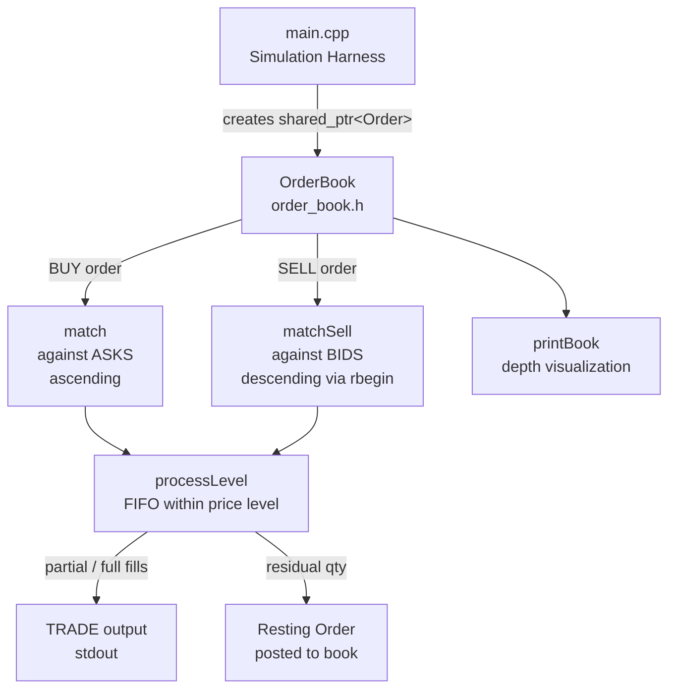
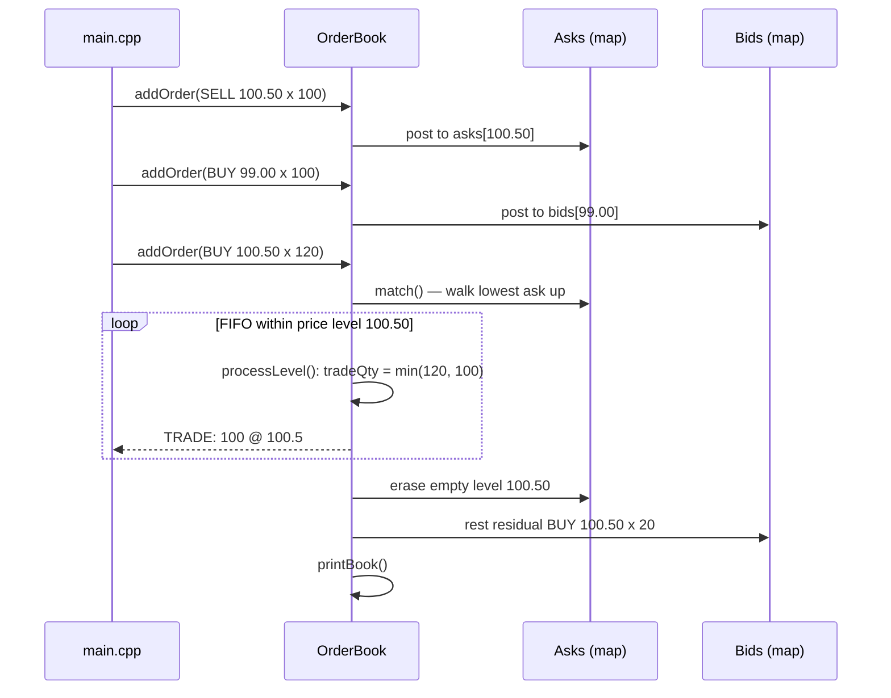
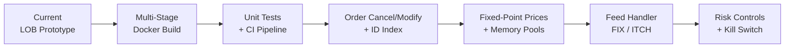

# C++ High-Frequency Trading Core

A **C++20 limit order book matching engine** implementing price-time priority matching, order lifecycle management, and a simulation harness. Built by **VisionQuantech** as the foundational core for a high-frequency trading system.

[](https://en.cppreference.com/w/cpp/20)
[](https://cmake.org)
[](LICENSE)

---

## ✨ Features

- **Limit Order Book** with separate bid/ask sides (`std::map<double, std::list<Order>>`)
- **Price-Time Priority Matching** — incoming orders are matched against the best counterparty price level first, FIFO within each level
- **Crossing / Aggressive Order Handling** — marketable orders sweep multiple price levels until filled or resting
- **Trade Execution Reporting** — matched trades are printed to stdout with quantity and execution price
- **Book State Visualization** — `printBook()` renders the current depth on both sides
- **Simulation Harness** — `main.cpp` seeds the book and submits an aggressive buy that eats through the spread

---

## 🏗️ Architecture / How It Works

The codebase consists of three core components under `src/`:

### 1. `src/order.h` — Order Model

Defines the `OrderType` enum (`BUY` / `SELL`) and the `Order` struct:

```cpp
struct Order {
  uint64_t id;
  OrderType type;
  double price;
  uint32_t quantity;
  uint32_t initial_quantity;
};
```

Orders are managed via `std::shared_ptr`, allowing the book and matching logic to share ownership safely.

### 2. `src/order_book.h` — Matching Engine

The `OrderBook` class maintains two price-level maps:

- **Asks**: `std::map<double, std::list<Order>>` — naturally ascending (best ask = `begin()`)
- **Bids**: same container, iterated in **reverse** (`rbegin()`) so the highest bid is matched first

**Matching flow (`addOrder`):**

1. An incoming order first attempts to **match** against the opposite side:
   - `BUY` orders call `match()` against asks, walking from the lowest ask upward and stopping when the ask price exceeds the buy limit.
   - `SELL` orders call `matchSell()` against bids, walking from the highest bid downward and stopping when the bid falls below the sell limit.
2. `processLevel()` performs FIFO matching within a single price level: the incoming order consumes resting orders in arrival order, emitting a `TRADE: <qty> @ <price>` line for each fill. Fully consumed resting orders are erased from the level.
3. If residual quantity remains after matching, the order is **posted to the book** at its limit price.
4. Empty price levels are erased from the map to keep the book clean.

### 3. `src/main.cpp` — Simulation Harness

The executable demonstrates the engine end-to-end:

1. Seeds the book with two asks (`100.50 x 100`, `101.00 x 50`) and one bid (`99.00 x 100`)
2. Prints the book state
3. Submits an aggressive `BUY` of 120 @ `100.50`, which fully consumes the first ask level (100) and rests the remaining 20 on the bid side
4. Prints the resulting book state

**Build system:** CMake ≥ 3.10, C++20, single executable target `HFTCore`.

### Component Diagram



### Order Matching Sequence



---

## 🚀 Building & Running Locally

### Prerequisites

- CMake ≥ 3.10
- A C++20-capable compiler (GCC 10+, Clang 10+, MSVC 2019+)

### Build & Run

```bash
# Clone the repository
git clone https://github.com/Shivay00001/cpp-high-frequency-trading-core.git
cd cpp-high-frequency-trading-core

# Configure and build
cmake -B build -S .
cmake --build build

# Run the simulation
./build/HFTCore        # Linux/macOS
# build\HFTCore.exe    # Windows
```

### Expected Output

```
Initializing HFT Simulation...
Order 1 (SELL) added to book @ 100.5 (100)
Order 2 (SELL) added to book @ 101 (50)
Order 3 (BUY) added to book @ 99 (100)

--- Order Book ---
ASKS:
101 (50)
100.5 (100)
----
BIDS:
99 (100)
------------------

Submitting Market Aggressive BUY...
TRADE: 100 @ 100.5
Order 4 (BUY) added to book @ 100.5 (20)
```

---

## 🐳 Docker Deployment

The project can be built and run entirely inside Docker — no local C++ toolchain required. Use the following Dockerfile (a multi-stage build that uses CMake to compile the `src/` tree and produces a minimal runtime image):

### Dockerfile

```dockerfile
FROM gcc:latest AS builder
WORKDIR /app
RUN apt-get update && apt-get install -y cmake && rm -rf /var/lib/apt/lists/*
COPY . .
RUN cmake -B build -S . -DCMAKE_BUILD_TYPE=Release && cmake --build build

FROM debian:bookworm-slim
WORKDIR /app
COPY --from=builder /app/build/HFTCore ./HFTCore
CMD ["./HFTCore"]
```

### Build & Run with Docker

```bash
# Build the image
docker build -t hft-core .

# Run the simulation (interactive output)
docker run --rm hft-core
```

This works on any laptop or server with Docker installed.

### Optional: docker-compose

If you prefer Compose, add a `docker-compose.yml`:

```yaml
services:
  hft-core:
    build: .
    container_name: hft-core
    stdin_open: true
    tty: true
```

Then run:

```bash
docker-compose up --build
```

---

## 📁 Repository Structure

```
.
├── CMakeLists.txt        # CMake build config (C++20, HFTCore target)
├── Dockerfile            # Container build definition
├── LICENSE               # VisionQuantech Custom Commercial License
├── .gitignore            # Ignores build/, bin/, .vscode/
└── src/
    ├── main.cpp          # Simulation harness / demo scenario
    ├── order.h           # Order struct and OrderType enum
    └── order_book.h      # OrderBook matching engine (header-only)
```

---

## 🛣️ Roadmap



---

## 📄 License

This software is distributed under the **VisionQuantech Custom Commercial License**:

- **Personal / educational / non-earning use:** free.
- **Personal revenue-generating use:** requires a 15–30% revenue share.
- **Business / enterprise use:** requires a separate commercial license — contact **visionquantech@proton.me**.

See the [LICENSE](LICENSE) file for full terms. The software is provided **"AS IS"**, without warranty of any kind.

---

*© 2026 Shivay00001 / VisionQuantech. All rights reserved.*